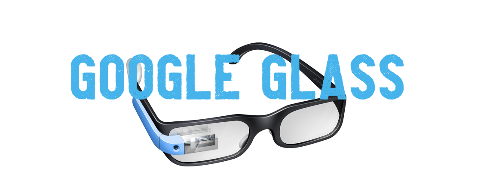

<h1>
    
</h1>
<h1>
    
</h1>

# Indice
- [Sobre](#-sobre)
- [Tecnologias utilizadas](#-tecnologias-utilizadas)
- [Como baixar o projeto](#-como-baixar-o-projeto)


## 📋 **Sobre**

  O projeto **Google Glass** Foi desenvolvido através do curso de html5 mais específicamente pelo **Gustavo Guanabara** onde eu fiz com o intuito de adquirir mais conhecimento nessa área, alé m de claro, desenvolver o meu primeiro site.

---

## 🔬 Tecnologias utilizadas 

O projeto foi desenvolvido utilizando as seguintes tecnologias:

- **CSS**
- **HTML**
- **Java Script**
---
## 💾 Como baixar o projeto

### Clonando o repositório a partir do git-bash:
 ```bash
    #Clonando repositório
    $ git clone https://github.com/Jornay/My-First-Site
 ```

### Clonando o repositório a partir do GitHub na web:

- Entre nesse link: https://github.com/Jornay/My-First-Site
- Após isso Click aqui: 


### Executando a página do projeto:
- Basta apenas clickar no executavel .html chamado index.html localizado dentro da pasta clonada.

---
### Desenvolvido por:
- [Gustavo Guanabara](https://twitter.com/guanabara)
### Montado por:
- [Lucas de Abreu](https://github.com/Jornay) 


